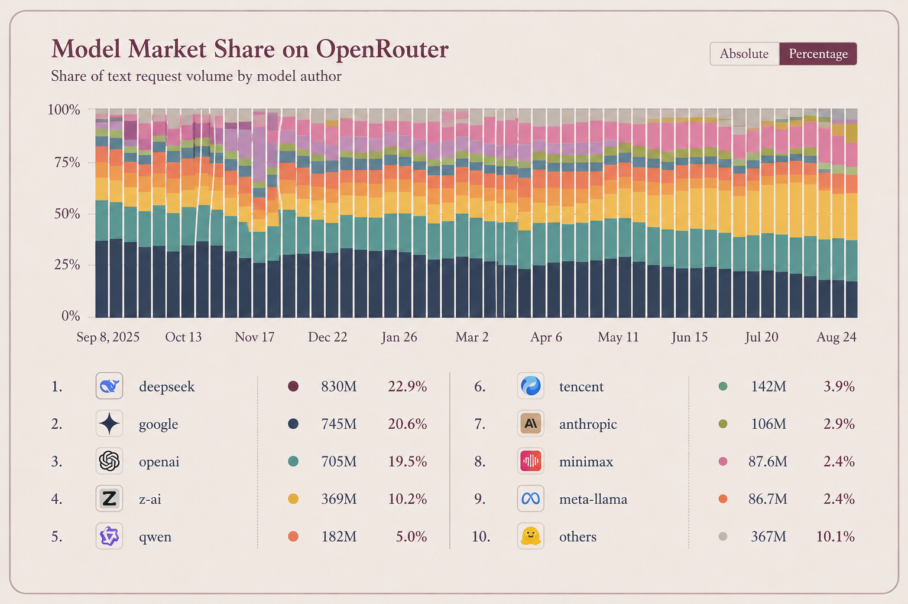

*Why AI's next unit of value may be what it produces, not what it consumes.*

We may be reaching a point where AI is being measured with the wrong unit. Technology has changed its unit of value before; for example, we've seen SaaS shift from perpetual licenses to subscriptions and seats. Salesforce was already charging ~\$50 per user in 1999. Cloud shifted the benchmark again: when AWS launched EC2 in 2006, customers paid \$0.10 per computer hour, turning consumption into the new unit price of value. Output pricing may be the next evolution in how technology assigns its value.

Competition is a driving force for this transition. Let's take a look at how the market has moved over the past year. At the beginning of 2026, DeepSeek accounted for roughly *9%* of all token volume through OpenRouter. By June, that share had doubled to *18%*, making it the largest model provider by token flow, while other Chinese providers including Alibaba's Qwen, Moonshot AI's Kimi, MiniMax, Xiaomi, Tencent, and Z.ai's GLM, increasingly competed alongside incumbents such as OpenAI, Anthropic, Google, and Meta. The scale and breadth of the market have expanded just as quickly. In late 2024, OpenRouter offered access to roughly *100+ models*, and by August 2026, it was processing more than *10 trillion tokens* per day across *400+ models.* To paint the picture further, OpenRouter's entire 2025 State of AI analysis covered roughly 100 trillion tokens from November 2024 to November 2025, equivalent to only about ten days of traffic at today's run rate.

  

Of course, as markets become more competitive and producers more interchangeable, price tends to move closer to marginal cost, forcing differentiation. Peter Thiel has made this argument, famously in *Zero to One,* illustrating that businesses trapped in perfect competition struggle to generate durable profits, while companies with monopoly-like differentiation can capture more value. Companies compete over an increasingly competitive product; economic profits are competed away, while durable value occurs to those that create something meaningfully differentiated. We are seeing this now with Anthropic, despite the proliferation of a myriad of cheaper alternatives, they have maintained a considerable premium at the frontier. They led across all six major benchmarking categories (code, debugging, etc), with Fable and Opus leading the race.

In short, tokens are flowing to open source and dollars to the foundation models.

Fable 5.1 still commands a significant premium at \$10 per million input tokens and \$50 per million output tokens, although Anthropic has lowered effective costs through caching, with cache reads falling 75% to \$0.25 per million tokens. Competitive pressure is pushing prices sharply lower elsewhere and is seen via OpenAI cutting GPT-5.6 Luna pricing by 80%, bringing it to just \$0.20 per million input tokens and \$1.20 per million output tokens.

However, if the current rate of acceleration continues with more capable models and longer memory and context windows, simply reducing token costs is unlikely to remain the defining competitive advantage. If the underlying cost of intelligence compresses, usage may become less a function of price and more a function of throughput. I.e., how much useful work a model can complete and how efficiently that work can be quantified. Intercom's Fin is a great example of this switch; of course, natively a customer service SaaS company, they have repositioned themselves heavily around AI. Fin is the autonomous customer-service agent that can answer questions and resolve support issues without a human agent handling every interaction. The basic model is \$0.99 per successful outcome. An outcome is essentially a customer interaction in which Fin successfully, in layman's terms, does what it's supposed to do, such as resolve a support ticket. Sierra is another example - customers should pay when the software achieves a specific, valuable outcome.

I believe this is where the next wave of AI companies will have to compete. As model access becomes cheaper and self-serve tools like Claude Code and Codex improve, differentiation will shift from providing intelligence to owning the workflow and delivering a measurable outcome.

---

Read more on [Michael's Substack](https://michaeljbarone.substack.com/)
