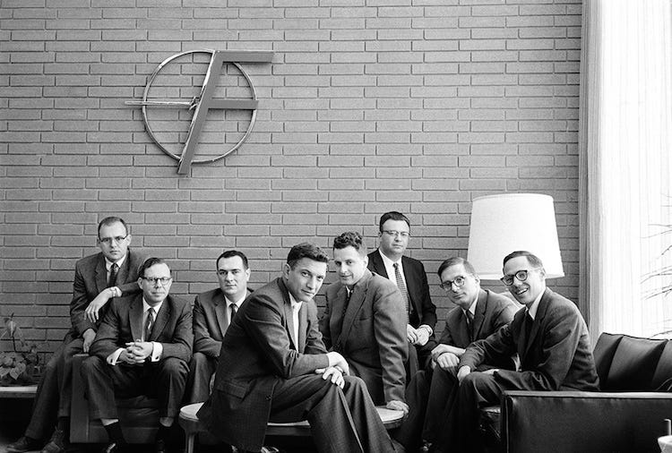

*From OpenAI to PayPal to Fairchild, the companies born after the fallout can be worth more than what came before.*

Some companies are cocoons. They concentrate unusual talent and ambition, but sometimes the most important legacy of a cocoon is the butterflies that leave it.

The Altman vs Musk feud is a reminder that some of the most successful companies in tech history have begun with a breakup.

In the case of the current feud, the harbinger wasn't this courtroom drama, it was the quieter exits that came before it.

- Dario and Daniela Amodei left OpenAI in 2021 to found Anthropic, now valued at over 900 billion dollars. John Schulman, another co-founder, defected to Anthropic.
- Ilya Sutskever, OpenAI's chief scientist and one of the architects of the failed 2023 board coup against Altman, walked out in May 2024 to co-found Safe Superintelligence (32B).
- Mira Murati, OpenAI's CTO, followed months later to launch Thinking Machines Lab (60B).

Of the eleven people who founded OpenAI in 2015, only two remain: Sam Altman and Wojciech Zaremba.

This is hardly the first time in Silicon Valley a breakup produced more value than the company left behind. The tumultuous coup at PayPal really only involved Musk, who was ousted as CEO while on his honeymoon in 2000, but the exodus that followed was company-wide. eBay bought PayPal in 2002 for 1.5 billion dollars, and within a few years, all but 12 of PayPal's first 50 employees had walked out the door. What they built next is staggering:

- Tesla and SpaceX (Musk)
- YouTube (Chad Hurley)
- Yelp (Jeremy Stoppelman)
- LinkedIn (Reid Hoffman)
- Palantir (Peter Thiel)
- Affirm (Max Levchin)

…and more. Today PayPal is worth about 40 billion dollars. The companies its alumni built next are collectively worth trillions.

The pattern goes back even further. In 1957, eight researchers walked out of Shockley Semiconductor in protest of Shockley's management style. The "Traitorous Eight" included:

- Eugene Kleiner (Kleiner Perkins)
- Gordon Moore and Bob Noyce (Fairchild and Intel)

Shockley Semiconductor itself was sold off by 1968. Today, Intel alone is worth around 546 billion dollars, and Kleiner Perkins has backed some of the largest companies in the world, including Google and Amazon. The lab that started it all is a historical footnote.

  

---

You could go as far back as Tesla and Edison and the pattern still seems to endure. Some brilliant teams eventually splinter. And when they do, there are times where what they build next tends to dwarf what they left behind.

Which leaves an open question. Could the next generation of trillion-dollar companies be incubated inside those whose breakups haven't happened yet?

---

[Read more on Michael's Substack](https://michaeljbarone.substack.com/)

