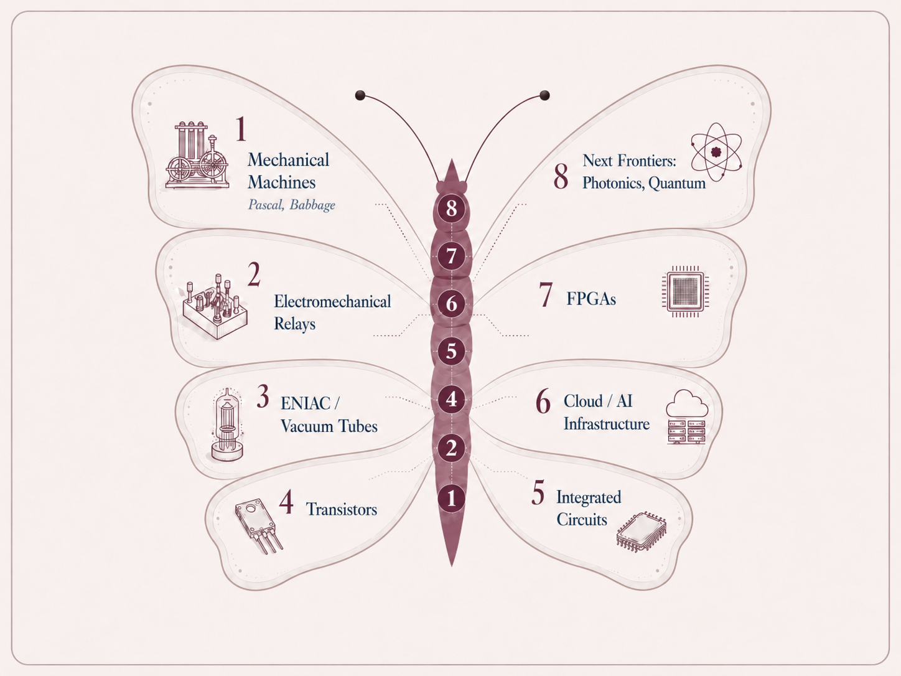

*Mechanical machines to programmable chips*

I was listening to an interview with Jeremy Grantham where he described his thinking as a kind of butterfly effect with ideas moving across semi-related topics before revealing a broader connection. Compute seems to have evolved similarly.

Early computing machines used physical movement to represent and manipulate numbers. There were devices like  Pascal's calculator that could perform addition and subtraction mechanically, and Charles Babbage's Analytical Engine which introduced early concepts resembling memory.

Electromechanical computing replaced many of these gears and levers with electromagnetic relays. Relay-based computers were faster than the mechanical machines, however they were limited by physically moving parts and faced difficulty adapting to new tasks because changing their operation often required rewiring or reconfiguring the machine.

Then came the ENIAC, developed in the 1940s, took a different approach by using vacuum tubes to switch electrical signals on and off. Thousands of calculations per second and far faster than earlier relay-based systems. However, ENIAC was enormous and still had to be manually rewired and configured for different applications.

The invention of the transistor by John Bardeen, Walter Brattain, and William Shockley, followed by Jack Kilby and Robert Noyce's integrated circuit made computers dramatically smaller and more flexible.

What does this all mean? Sure, we have Moore's Law and other governing principles that have shaped the future of compute, but what is the commonality and relationship between each of the phases above?

Gears moved physical objects → relays moved electrical switches → vacuum tubes controlled electrical signals → transistors made those switches microscopic → integrated circuits packed billions of them onto individual chips.

Electromechanical systems were faster than gears, ENIAC performed far more calculations than relay-based machines, and chips ultimately allowed compute to scale. The common theme thus could be categorized as  flexibility. Each subsequent invention made computing faster and easier to adapt to different use cases i.e more malleable. Over time, computation became less dependent on physically reconfiguring the machine and more dependent on programmable systems that could support a much wider range of applications.

A consensus today is that Moore's law is dead or ending because it has become much harder and more expensive to keep doubling the number of transistors on a chip every two years (atomic scaling limits, heat and power requirements, cost of building fabs, etc).

However, across the venture ecosystem, we are still seeing the same broader trend toward greater flexibility. Whether through more malleable AI models, programmable chips, orchestration layers, or human-in-the-loop systems, the goal remains the same. After any era of universal adoption and human capital growth, the next logical phase will emphasize customization.

Just look across the compute supply chain recently-

- On the materials side, CuspAI is using AI to accelerate the discovery of new materials that could improve the underlying performance of compute infrastructure. (\$450 million Series B announced in July)

- On the chip side, Rapid Silicon is building FPGAs that can be reprogrammed for different workloads (although didn't raise this quarter).

- Unconventional AI is developing a new type of AI computer using the physical behavior of silicon circuits to perform calculations, rather than relying on conventional digital processing i.e making compute dramatically more energy efficient (\$475 million seed round in December 2025 at a \$4.5 billion valuation)

- Fireworks AI allows companies to run and optimize AI models without having to build and manage the underlying inference infrastructure themselves (\$1.505 billion Series D announced in July, at a \$17.5 billion valuation)

Even companies like SkyPilot (\$20 million seed round announced in July) add another layer of flexibility with workflows moving across clouds or Kubernetes clusters, and on-premise GPUs based on cost and availability. 

  

How far can we stretch the idea of malleability? Looking at how computing evolved from mechanical machines to modern chips makes technologies like quantum and photonic computing feel less like science fiction and perhaps next on the path.
