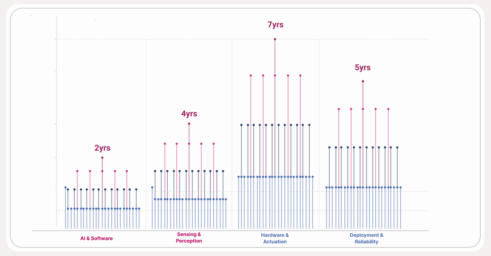

  

*A robot won the Beijing half-marathon in April. The timeline may be compressing faster than expected.*

---

Hardware has become an increasingly attractive space that has the potential to endure — it directly benefits from the knock-on effects of frontier models while staying insulated from them. Hardware doesn't get commoditized overnight.

The robotics taxonomy can be broadly viewed across physical architecture to end market, where defence and security occupy the largest chunk. 2025 was a watershed moment for robotics capital. The sector recorded roughly $28B invested across 1,000 deals — double the $13B invested in 2024. The tech stack underpinning modern robotics reached an inflection point in 23/24, and it happened at the software layer first. VLA models went from research to commercial products in two years. By 2026, VLAs have become the primary backbone of the industry, with fine-tuned models now consistently outperforming custom robotic policies trained from scratch. NVIDIA's Cosmos world models and Newton physics engines are enabling robots to train on synthetic data at scale, efficiently closing the gap between virtual training and real-world development.

Outside of technological development, the US regulatory environment for robotics is moving in a favorable, supportive, and coherent direction. On drones, the FAA published the long-awaited Part 108 NPRM in August 2025, creating a standardized performance-based framework for beyond-visual-line-of-sight operations and removing the need for individual waivers. On autonomous vehicles, NHTSA has proposed amending Federal Motor Vehicle Safety Standards to remove human-driver assumptions, eliminating requirements like windshields, gear shifts, and defogging — with the stated goal of enabling commercial AV deployment. However, deregulating at the federal level doesn't solve the patchwork underneath it. H.R. 7334, the National Commission on Robotics Act, would establish an independent 18-member expert commission to assess US competitiveness — the next step toward a coordinated national posture that Germany and China already have.

In the US specifically, addressing the trade deficit through domestic manufacturing would require an estimated 5 million additional workers. At the same time, 95% of US industrial businesses plan to deploy new automations within the next three years. The driver isn't just enthusiasm for tech, but the reality that labor supply may not keep up with demand. Coupled with the reshoring agenda, this makes domestic automation economically necessary rather than optional. The sector has a societal pull that exists independent of any single technology or political cycle.

**What's next?**

The focus will need to be geared toward shared economic benefit, emphasizing controlled environments first as a path to social adoption. This means the 95% of US industrial businesses planning new deployments need to design for labor working *alongside* robots. In the AI world, the term "human in the loop" has become a household phrase as agents become part of the org chart — a similar framing is necessary in robotics.

  

The four most pressing walls in robotics are:

1. AI & Software
2. Sensing and Perception
3. Hardware & Actuation
4. Deployment and Reliability

---

**AI & Software**

- VLAs are the AI systems that take in a camera feed and output direct motor commands in one unified model. Before VLAs, robotics needed (1) seeing, (2) planning, and (3) acting. These models collapse all three into a single neural network. Gemini Robotics, Google DeepMind's VLA built on top of Gemini 2.0, is a model worth following.

- Simulation-based training has unlocked the scale VLAs need to learn. Rather than grinding through thousands of costly real-world repetitions, robots now train in virtual environments where data compounds overnight rather than over months. Nvidia's Cosmos and Isaac Sim are generating synthetic data at scale. Tesla's Optimus and Boston Dynamics' Atlas are both training primarily in simulation before touching the physical world.

- On-device inference is catching up. VLA models can carry billions of parameters, and routing through the cloud compounds latency to a point no real-time robot can tolerate. Quantized compression has pushed models to 10–25 frames per second on consumer-grade GPUs, with Nvidia's Jetson Thor chip leading the charge.

**Sensing & Perception**

- The gaps are in data. VLAs handle novel variation far better than scripted systems, but mid-task recovery is still unsolved. Non-visual sensory data is an even deeper bottleneck: force, haptic, and thermal data cannot yet be generated synthetically at scale. You cannot train a hand to feel if you have no feeling data to train on.

- For structured environments with normal objects, robot vision is basically at production readiness. Years of progress in computer vision — driven by autonomous vehicles and smartphones — have made visual perception one of the more mature layers in the stack.

- Tactile sensing is a few years behind. Sensors embedded in fingertips and palms that measure contact force, pressure, slip, and temperature exist, but full tactile arrays at commercial scale are not there yet.

**Hardware & Actuation**

- Energy density is the next wall. Lifting, walking, and manipulating are power-hungry operations, and current lithium-ion batteries give most platforms just one to eight hours of runtime depending on task intensity. Solid-state batteries reached early vehicle deployment in 2026, but their power-draw profiles are not yet optimized for the dynamic demands of a humanoid robot.

- Certain types of robotics — especially humanoids — are ~200,000x more complex to operate than simpler robotic counterparts like AMRs. This is primarily due to complex kinetic demands: increased degrees of freedom, dynamic mobility, and perception and adaptability requirements.

- Joint actuators alone account for 30–50% of a humanoid robot's total bill of materials, and the supply chain for components is not yet exhaustive enough to scale at automotive scale outside of China.

**Deployment & Reliability**

- Industrial operators demand reliability measured in fractions of downtime per year. A production line stoppage costs tens of thousands of dollars per minute, so the gap between "works in the demo" and "works reliably enough to anchor a production line" is not a minor caveat.

- The deeper issue is edge cases. The fault modes of current robot vision are a blocker for consumer deployment. Warehouses and factories are frequently engineered around this limitation. Move a robot into an uncontrolled setting like a hospital room, and failure rates climb significantly.

- There are some encouraging developments. Honda's ASIMO struggled to navigate a flat floor in 2000. Boston Dynamics' Atlas, with 56 degrees of freedom, now autonomously navigates to its charging station while handling physical obstacles in its path.

---

The industry as a whole is not waiting for a breakthrough moment. The breakthroughs are already happening with the advancement of VLAs and simulation-based training. As capital continues to flood in, I believe we could reach a Moore's Law of robotics — capability per dollar doubling on a predictable cadence, driven by VLAs on one side and accumulated real-world data on the other. The models ride the frontier; the data builds the moat. Together they compound.

The path forward is crawl-walk-run: solve unstructured environments at scale, then use that operational data to train for messier, less predictable ones. But the timeline may be compressing faster than expected.

A robot won the Beijing half-marathon in April.

---

[Read more on Michael's Substack](https://michaeljbarone.substack.com/)

