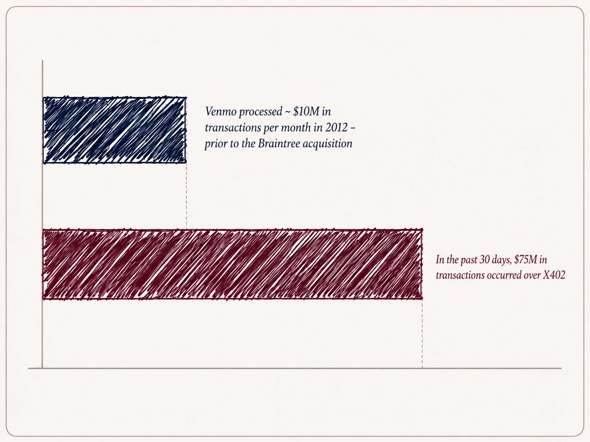
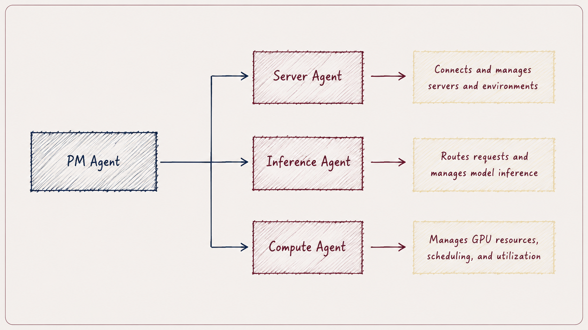

*Connecting ideas and open source to emerging themes across the startup ecosystem.*

The foundation of agentic commerce has largely been laid out by a handful of major incumbents, each attempting to own a different part of the transactions stack which I categorize loosely as merchant connectivity, identity and verification, agent permission, payment rails, and post purchase tracing.

Google is closest to the consumer, owning discovery through search and Gemini, merchant connectivity through its UCP, and agent permissions through AP2. Coinbase is building the onchain alternative, giving agents their own wallets through AgentKit and using x402 to autonomously pay for digital services with stablecoins. Visa is focused on trust and transaction security, using its Trusted Agent Protocol to verify agents and move payments across VisaNet. Mastercard is taking a similar position through Agent Pay and Verifiable Intent, combining consumer authorization, agent-specific tokens, auditability, and its existing card network.

  

Stripe may be the furthest ahead in stitching the full stack together. Its Agentic Commerce Suite connects merchants to AI agents (similar to Google’s UCP), and its ACP standardizes the checkout flow. Link and Shared Payment Tokens secure the credential, and Stripe handles fraud, orchestration, processing, and settlement. Its ambitions also extend in the M&A market as the company offered $53 billion for PayPal, while also in discussions to acquire OpenRouter at $10 billion

Despite incumbents touching many areas of the supply chain, if you’re a believer that agents will eventually be completing transactions on behalf of humans in certain industries, the underlying infrastructure still needs to evolve.

The B2B procurement space is a good example of this where 61% of procurement leaders cite geopolitical and supply risk as top concerns, and by 2028 half of G2000 manufacturers are expected to operate AI enabled supply chains. However, in the interim, product data must be machine readable, API integration must be seamless, clear guardrails and compliance layers must be present, and much more.

---

**Paper of the week:** ***<u>[Paymenter](https://github.com/Paymenter/Paymenter)</u>*** *(2k stars)*

Agentic commerce may continue to emerge first in areas like compute, where demand is measurable and purchases can be provisioned immediately through software.

Paymenter is open-source software for companies selling hosting and servers as well as cloud resources. It manages the following purchasing flow:

select a server → pay → receive an invoice → provision the resource → manage the subscription

An agent could use the same infrastructure to automatically purchase more compute or scale capacity without manually completing checkout.

  

---

Recent funding funding…

Natural: Payments infrastructure built for AI agents. Raised a $30 million Series A led by Forerunner announced in July.

Orthogonal: Infrastructure that helps agents discover services, route transactions across blockchains, and execute machine-to-machine payments. Raised a $4.3 million seed round from Pantera Capital, Y Combinator, Pioneer Fund, Decasonic, Blast, Outbound, and Surreal announced in June.

Trustap: Transaction and escrow infrastructure that verifies sellers, manages payments, and supports secure purchases by AI shopping agents. Raised $10 million from Aperture Capital announced in June.

ShopAgentic: Merchant infrastructure for product data, inventory visibility, pricing, and agent-led transactions. Raised a €1.9 million pre-seed round from May Ventures and Greenfield Capital announced in June.

More to come on the subject soon…

---

Read more on Michael’s Substack ([https://michaeljbarone.substack.com/](https://michaeljbarone.substack.com/))
