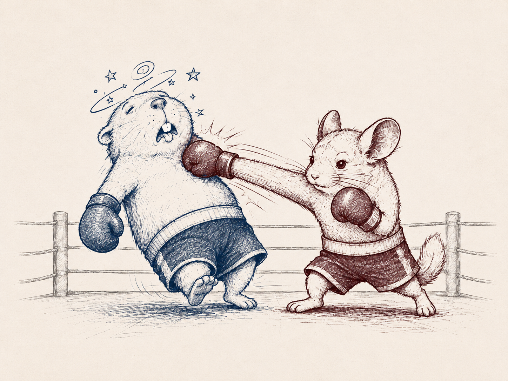

*Connecting research and open source to emerging themes across the startup ecosystem.*

This week is a bit of a throwback. I've been thinking a lot about what has become table stakes for "quality" of compute and what the emerging consensus is around benchmarks that actually matters for models.

One number I keep coming back to is what is the optimal number of parameters relative to compute. Training costs are notoriously opaque for closed-weight models. While inference is somewhat easiest to estimate.

Take GPT-4. A reasonable outside estimate puts its training compute at roughly 2 × 10²⁵ FLOPs, with some estimates implying something like 10,000-25,000 A100 GPUs running for several months. Anthropic similarly does not publish the training compute behind its frontier Claude models, but estimates for models in this class generally land somewhere in the 10²⁵-10²⁶ FLOP range, depending on the generation and assumptions.

For some perspective, a FLOP is a floating-point operation (one mathematical calculation performed by a GPU for example, as 3.2 × 4.5 = 14.4 is roughly one FLOP). So when we say a model required ~10²⁵ FLOPs to train, we are talking about tens of septillions of mathematical operations.

It depends on the GPU, but the conversion is:

1 GPU-hour = GPU FLOPs/second × 3,600 seconds.

A100: 312 TFLOPS → about 1.1 × 10¹⁸ FLOPs per GPU-hour.
H100: 1,979 TFLOPS → about 7.1 × 10¹⁸ FLOPs per GPU-hour.

…enough math

---

**Paper of the week (more like of 2022): [Training Compute-Optimal Large Language Models](https://arxiv.org/abs/2203.15556?utm)**

The author's core insight was that the largest model (in terms of parameters) is not necessarily the best use of compute. They tested this pretty aggressively and trained more than 400 models running from 70M to 16B+ parameters and 5B to 500B tokens.

Their conclusion was that most large language models at the time were actually undertrained because researchers were scaling parameter count much faster than the amount of training data.

The memorable result was Chinchilla itself. DeepMind trained a 70B-parameter model on 4× more data/tokens than Gopher, while keeping roughly the same training compute budget. Despite being one-quarter the size of Gopher's 280B parameters, Chinchilla beat it across a broad set of benchmarks (Chinchilla reached 67.5% average accuracy, more than 7 percentage points above Gopher).

***Why this is important (still today!): The insight was basically don't just throw your compute budget into more parameters. For compute-optimal training, their experiments suggested that when you double model size, you should also roughly double the number of training tokens. That was a pretty meaningful shift from "bigger model = better model" toward thinking about the ratio of model size, data, and compute.***

***Today, for start-ups to build a defensible moat regardless of the industry they operate in, data is one part and your intelligence is the other. In [last week's article](https://michaeljbarone.substack.com/p/signals-and-startups-no-3-continual) I discussed continuous learning. I have been seeing more frequently that some sort of fast/slow loop of some type of feedback loop / stitching of RL is necessary to build a defensible product.***

***If a company is collecting proprietary data that Anthropic and OpenAI can't scrape, the now low hanging fruit is the intelligence layer on top that keeps improving even as foundation models catch up (just watch out for Micro1 and Mercor)***

  

---

Recent funding snapshot…

**Trajectory**: SF based lab developing a platform that enables continual learning for AI-powered products. Raised **\$40M** in August led by Sequoia Capital with participation from Bessemer Venture Partners and NVIDIA.

**River AI**: A API for fine-tined RF, enabling users to build and serve personalized AI models. Raised a **\$1.1 billion** round led by AMP PBC and General Catalyst with participation from AMD, NVIDIA, Temasek, and Y Combinator, announced in August.

**Fireworks AI**: Infrastructure to train, serve, evaluate, and improve open models on proprietary data. Raised a **\$1.5 billion Series D** led by Atreides Management, Index Ventures, and TCV with participation from Lightspeed, NVIDIA, Bessemer Venture Partners, and others, announced in July.

**DeweyLearn**: Combines audio, video, learning data, and domain expertise to assess real-world performance and produce expert-level feedback. Raised a **\$5 million Series A** led by SJF Ventures with participation from Catalysis Capital Management, Morningside, and Owl Ventures, announced in July.

---

Read more on [Michael's Substack](https://michaeljbarone.substack.com/)
