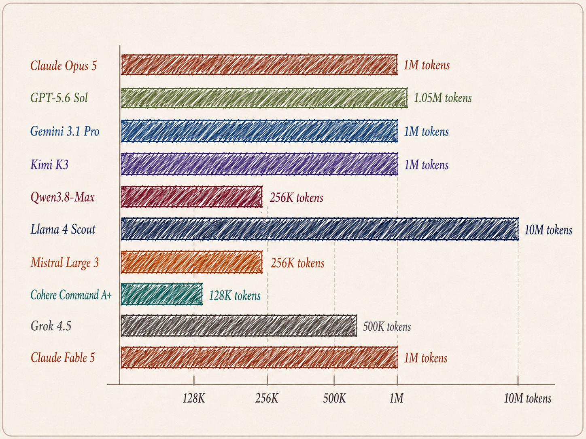

*Connecting research and open source to emerging themes across the startup ecosystem.*

Memory has become one of AI's loudest conversations. Earlier in the summer, Micron projected that its next generation of high-bandwidth memory (HBM4) could drive up to a 2.6x increase in inference throughput. NVIDIA has been making similar noise, designing its next-generation Rubin architecture around HBM4 and nearly tripling memory bandwidth versus Blackwell. Adjacently, Nvidia committed \$4B to Lumentum to expand optical networking capacity for data centers.

Closer to the end user, memory has a completely different form, giving agents the ability to retain context and reuse what's already been learned instead of starting from scratch. Everyone is familiar with a context window, and the graphic below displays a snapshot of the newest models'. Context windows will inevitably expand; however, there are diminishing bragging rights to token maxing. The more interesting metric I think most people can agree on is throughput per token.

There's a limit to how far memory can go without continually improving the model on past instances. Markdown files and vector dbs are useful for retrieval, and you can get creative on the types of retrieval algorithms to reduce latency; however, they are still fundamentally static representations of past experiences.

  

---

**Paper of the week: [OPD-Evolver](https://arxiv.org/pdf/2606.17628)**

The authors of OPD recommend a multifaceted approach to self-evolving agents that combines a fast loop for immediate adaptation through memory with a slow loop that periodically distills useful experience into the model's weights.

  

In practice this would look something like:

**Fast loop**: web/data task → retrieve Tip 8: "Avoid clicking ads" + Skill 19: pandas reshuffling → agent executes task → gets feedback → writes a new skill such as "Pandas for reshuffle" or a tool such as draw.io for visual output → periodically merges/deletes redundant memories.

**Slow loop**: look across those completed tasks → identify which tips/skills/tools actually led to better outcomes → give that hindsight to the teacher (same model with hindsight / extra information) → distill the successful behavior into the student (model before learning) → backpropagate and update the model weights → deploy the improved model.

Why this is important → As agents learn to "avoid ads" in the example above through memory, that recursive learning behavior that gets backfilled in markdown files actually has underutilized benefits. The slow-loop training distills frequently used behaviors into model weights and can reduce retrieval overhead, context-window usage, latency, and inference cost while making agent behavior more consistent at scale.

---

Recent funding snapshot…

**Wakeline**: Builds continuously learning AI systems that adapt from live operational data after deployment without requiring full retraining or redeployment. Raised a **\$2.4 million Pre-Seed** led by TechVision Fonds with participation from Neoteq Ventures, announced in June.

**RELAI**: Builds infrastructure that analyzes AI agent failures and feedback to continuously improve prompts, workflows, and memory based on prior performance. Raised a **\$5.4 million Pre-Seed** led by .406 Ventures with participation from AI Tinkerers Fund, announced in June.

**More to come on the subject soon…**

---

Read more on [Michael's Substack](https://michaeljbarone.substack.com/)
