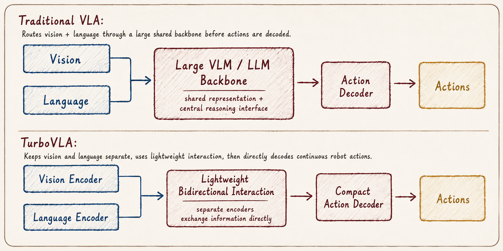

*Connecting research and open source to emerging themes across the startup ecosystem.*

What does a robot's brain actually look like? A VLA? A world model? (VC's favorite buzzword these days.) Oftentimes it's a stack, not a single element. Take Figure's [Helix 02](https://www.figure.ai/news/helix), for example: it uses a VLA-based system and extends that neural network across the robot's entire body, allowing perception and full-body control to operate as one integrated stack.

Across the inference stack, a few architectures have emerged as the leading contenders for the robot's "brain":

**VLA (visual-language-action model)** is the robot's action producing brain, and turns what it sees into physical movements. At heart, VLAs are built on collecting enormous datasets and training one large, end to end network. OpenVLA and π are flagships here.

**WAM (world-action model)** predicts how the environment will change and outputs actions to reach a specific goal. World models alone predict how the environment will change and output a proposed action.

**TAMP + FMs** combines traditional robotics planning with foundation models. Task planning decides the high level action, i.e. pick up the cup, motion planning calculates the robot's trajectory and collision free movements, and lastly, the foundation model interprets the language instruction and helps select the appropriate tasks.

*Anthropic's [Claude Plays Robotics](https://www.anthropic.com/research/claude-plays-robotics) compared four different approaches using Claude to (1) directly control motors or forces, (2) write control code, (3) train a robot's policy using RF, and (4) provide high level instructions to an existing pretrained policy or VLA. The conclusion was that Claude is poor at low level motor control, but much better as a planner. For example, Claude was successful at defining where a quadruped should navigate, and the pretrained VLA handles the individual joint movements.*

---

**Paper of the week: TurboVLA**

Most VLAs route everything through an LLM, i.e. robot sees an image, converts it into the LLM's representation space (pretrained on massive datasets), decodes the output into action.

TurboVLA is not proposing a replacement for the VLA layer, however, it redesigns the routing so that visual and language features are input directly into a compact decoder.

  

Hypothetically, TurboVLA could replace a 3.3B-parameter model like π₀ with a 0.2B-parameter architecture.

Why this is relevant: I mentioned in a [previous post](https://michaeljbarone.substack.com/p/robots-are-winning-marathons) that on-device inference is an area of improvement in robotics. Models carry billions of parameters, and routing them from the cloud compounds latency. Quantized compression has pushed models to 10-25 frames per second using Nvidia's Jetson Thor chip, however, Turbo points to another solution by removing the LLM from the center of the loop, requiring less compute and memory.

---

Recent funding snapshot…

**Xynova**: Builds dexterous robotic hands, arm-hand coordination systems, and motion-control algorithms for embodied AI systems. Raised a **\$500 million Series A** led by Meituan announced in July.

**Striding AI**: Building physical AI systems across world action models, reinforcement learning, robot hardware, and deployment engineering. Raised a **\$100 million seed round** from Charoen Pokphand Group, Huaqin Technology, and Jiuan Medical announced in July.

**Aether AI**: Building world models for physical AI and robotics to help robots reason about interventions. Raised a **\$20 million seed round** led by MPCi announced in June.

**Odyssey**: Builds general-purpose world models that simulate physical environments to train and test robotics and AI systems. Raised a **\$310 million Series B** led by Natural Capital announced in June.

**Generalist AI**: Develops AI foundation models for robots to learn and perform physical tasks. Raised a **\$400 million Series B** led by Radical Ventures announced in June.

**More to come on the subject soon…**

---

Read more on [Michael's Substack](https://michaeljbarone.substack.com/)
